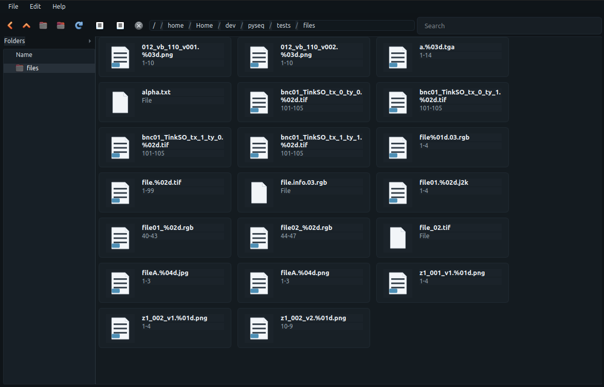

# sview

`sview` is a sequence-aware filesystem browser built with PySide6 and `pyseq`.
It provides a sequence-first view of directories so image sequences can be
browsed as logical units instead of individual files.



## Install

```bash
pip install -U sview
```

## Run

Launch the app:

```bash
sview
```

Open a specific folder:

```bash
sview /mnt/projects/
```

Print the version:

```bash
sview --version
```

Run with scanner debug output in the terminal:

```bash
sview --debug
```

## Configuration

On first launch, `sview` writes a user config file to:

```bash
~/.config/sview/config.json
```

This file controls default file and sequence handlers, including custom
commands for double-click actions.

It also contains scanner worker safety settings such as process priority and
memory limit:

```json
{
  "scanner": {
    "worker": {
      "nice_increment": 15,
      "memory_limit_mb": 2048,
      "timeout_seconds": 30
    }
  }
}
```
